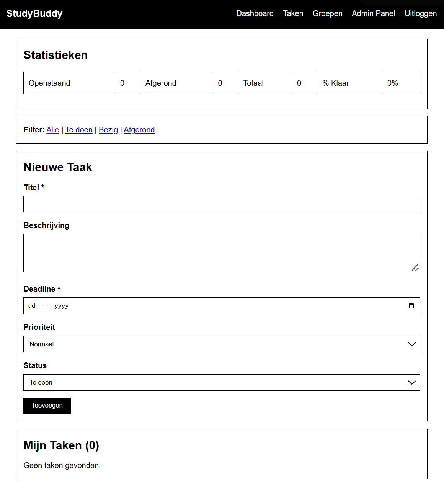
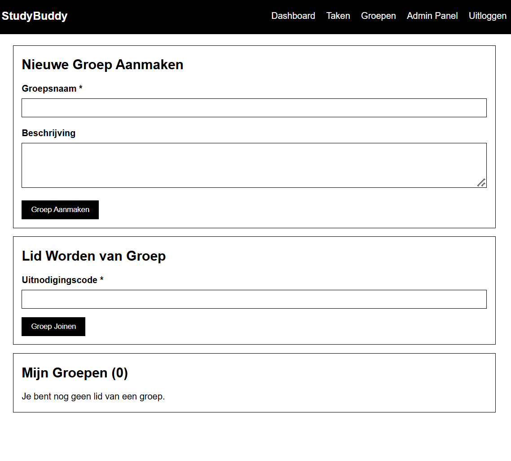
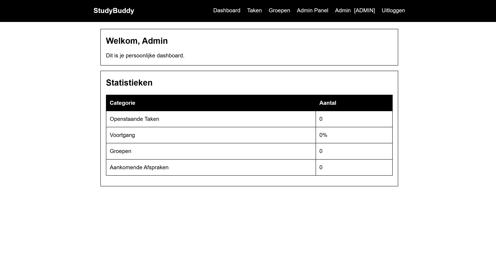
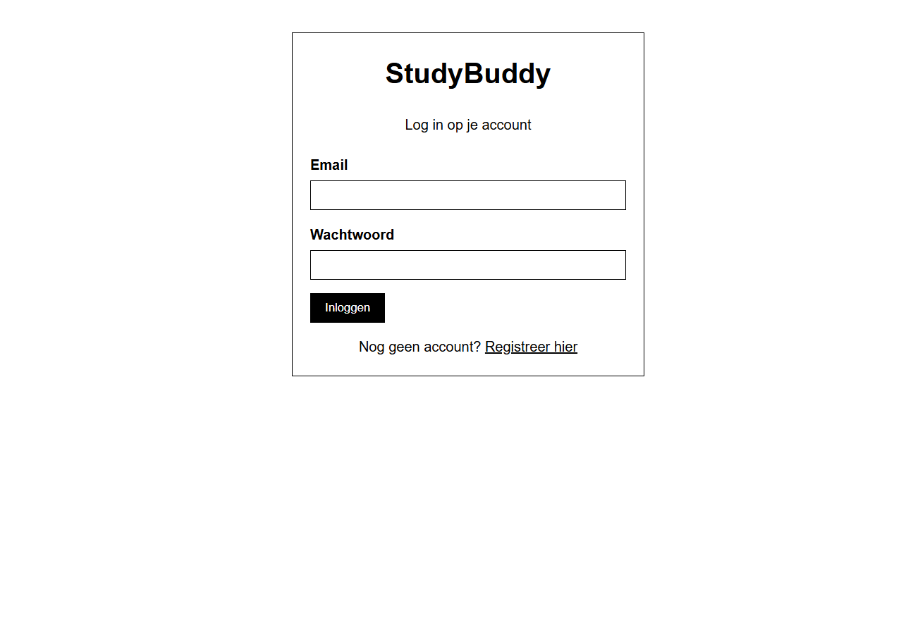
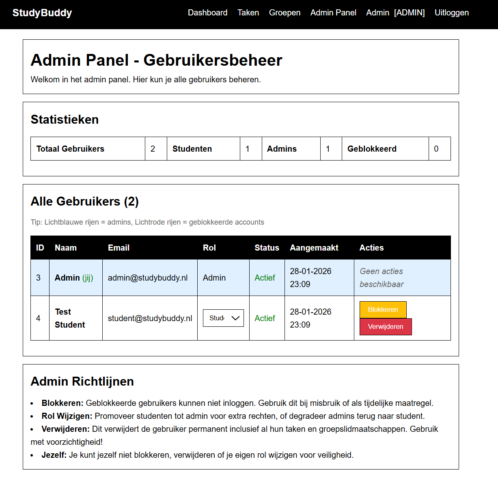

# StudyBuddy

Studiegroepen organiseren en taken delen wordt eenvoudig met StudyBuddy. Dit is een webapplicatie speciaal ontwikkeld voor studenten van ROC Nova. Hier kunnen zij hun taken plannen, studiegroepen beheren en afspraken coördineren.

## Wat kun je doen met StudyBuddy

### Je persoonlijke taken organiseren

Houd je huiswerk en opdrachten bij in een persoonlijk takenlijstje. Voor elke taak bepaal je zelf:

- De titel en beschrijving
- De deadline
- De prioriteit (laag, normaal of hoog)
- De status (te doen, bezig of afgerond)

Je kunt je taken filteren op status, zodat je precies weet wat nog moet gebeuren. Bovendien zie je in een oogopslag hoeveel procent van je taken al klaar is.

### Studiegroepen samenstellen

Werk samen met klasgenoten door studiegroepen te maken. Als je een groep aanmaakt, worden anderen lid door een unieke code in te voeren. In de groepdetails zie je wie er allemaal lid zijn.

### Afspraken inplannen

Per groep kun je afspraken inplannen voor gezamenlijk studeren of projectwerk. Bij elke afspraak zet je:

- Datum en tijd
- Locatie of een online link
- Het onderwerp

Elk groepslid kan aangeven of hij erbij kan zijn, misschien komt, of niet kan. Zo zien alle leden meteen wie er invallen.

### Je voortgang weergeven

Op het dashboard krijg je een mooi overzicht van alles wat er speelt:

- Hoeveel taken nog open staan
- Hoeveel taken al afgerond zijn
- Wanneer je volgende afspraak plaatsvindt
- Overzicht van je groepen

## Inloggen en registreren

Registreer jezelf met je naam, e-mailadres en wachtwoord. Je wachtwoord wordt veilig versleuteld opgeslagen in de database. Na registratie kun je direct inloggen.

## Test accounts

Als je de database hebt geimporteerd zijn er twee testaccounts klaar om mee te experimenteren:

**Admin account**
- E-mailadres: admin@studybuddy.nl
- Wachtwoord: admin123
- Dit account heeft toegang tot het beheerpaneel voor gebruikersbeheer

**Student account**
- E-mailadres: student@studybuddy.nl
- Wachtwoord: student123
- Dit account heeft normale studentrechten

Let op: verander deze wachtwoorden als je gaat produceren.

## Hoe werkt het beheerpaneel

Admins kunnen gebruikers beheren via het beheerpaneel. Hier kun je:

- Alle geregistreerde gebruikers zien
- Accounts blokkeren of deblokkeren
- Rollen veranderen van gebruikers
- Accounts verwijderen (met bevestiging)

## Hoe is het bouwwerk in elkaar gezet

### Technologie

- Taal: PHP 8 en hoger met Object Oriented Programming
- Database: MySQL
- Bouwwijze: MVC patroon met aparte classes en views
- Veiligheid: PDO met prepared statements en gehashte wachtwoorden

### Projectstructuur

De applicatie bestaat uit deze onderdelen:

shitzooi/
 db.sql                       Databaseschema en testdata
 README.md                    Deze file
 nginx_php_db.sh             Setup script
 images/                      Screenshots
    studybuddy_admin.png
    studybuddy_dashboard.png
    studybuddy_groepen.png
    studybuddy_login.png
    studybuddy_taken.png
 opdracht/                    Projectdocumentatie
    user_stories.md         User stories met criteria
    opdracht.txt            Originele opdracht
    fotos/                  Ontwerp afbeeldingen
 shitv2/                      Hoofdapplicatie
     classes/                PHP classes voor OOP
        Database.php       Databaseverbinding
        User.php           Gebruikersbeheer
        Task.php           Takenbeheer
        Group.php          Groepenbeheer
        GroupMember.php    Groepslidmaatschap
        Appointment.php    Afspraken
        AppointmentResponse.php  Reacties op afspraken
        DashboardHelper.php      Dashboard statistieken
     config/                Configuratie
        config.php         Database en settings
     public/                Webinterfacebestanden
         dashboard.php      Dashboard pagina
         tasks.php          Takenbeheer
         groups.php         Groepenoverzicht
         group_detail.php   Groepsdetails en afspraken
         admin.php          Admin panel
         login.php          Inlogpagina
         register.php       Registratiepagina
         logout.php         Uitlogafhandeling
         test_connection.php Databasetest
         views/             Herbruikbare onderdelen
         style.css          Stijlblad

## Hoe het systeem is opgebouwd

### Gebruikers en rollen

De applicatie onderscheidt twee soorten gebruikers:

- Studenten kunnen hun eigen taken beheren, groepen aanmaken en deelnemen aan afspraken
- Admins beheren gebruikersaccounts en kunnen ze blokkeren of verwijderen

### Database

Het systeem werkt met zes tabellen:

1. **users**: Gebruikersaccounts met e-mailadres, gehashed wachtwoord en rol
2. **tasks**: Persoonlijke taken van studenten met deadline en prioriteit
3. **groups**: Studiegroepen met een unieke uitnodigingscode
4. **group_members**: Lidmaatschap van groepen
5. **appointments**: Afspraken binnen groepen
6. **appointment_responses**: Reacties van groepsleden op afspraken

### Veiligheid

Het project beschermt gebruikersgegevens op deze manieren:

- Wachtwoorden worden gehasht opgeslagen (bcrypt)
- SQL injection voorkomen met PDO en prepared statements
- CSRF tokens op formulieren
- Input validatie en opschoning
- Toegangscontrole per rol (student of admin)
- Accounts kunnen worden geblokkeerd
- XSS bescherming

### Extra mogelijkheden

Naast de basisvereisten bevat het project:

- Dashboard helper class voor herbruikbare statistieken
- Taken statistieken en voortgang per student
- Groepsstatistieken (aantal leden, afspraken)
- Geavanceerd filteren op taken
- Mogelijkheid voor studenten om groepen te verlaten
- Volledige reactiesysteem op afspraken
- Grondige invoervalidatie
- Foutafhandeling met try catch blokken
- Databaseintegriteit met foreign keys

## Vereisten

- PHP 8.0 of hoger
- MySQL 5.7 of hoger
- Een webserver (Apache, Nginx)
- Composer (als je PHP packages wilt beheren)

## Installatie

1. Clone de repository
2. Import het databaseschema via db.sql
3. Configureer de databaseverbinding in shitv2/config/config.php
4. Zet de webserver op de public map te wijzen
5. Navigeer naar de website en log in met een testaccount

## Startpagina

Na inloggen kom je op het dashboard waar je al je actieve taken en aankomende afspraken ziet. Vanuit het menu kun je naar:

- Taken: voor het beheer van je persoonlijke takelijst
- Groepen: om groepen te bekijken, aanmaken of toe te treden
- Admin panel: alleen beschikbaar voor admins
